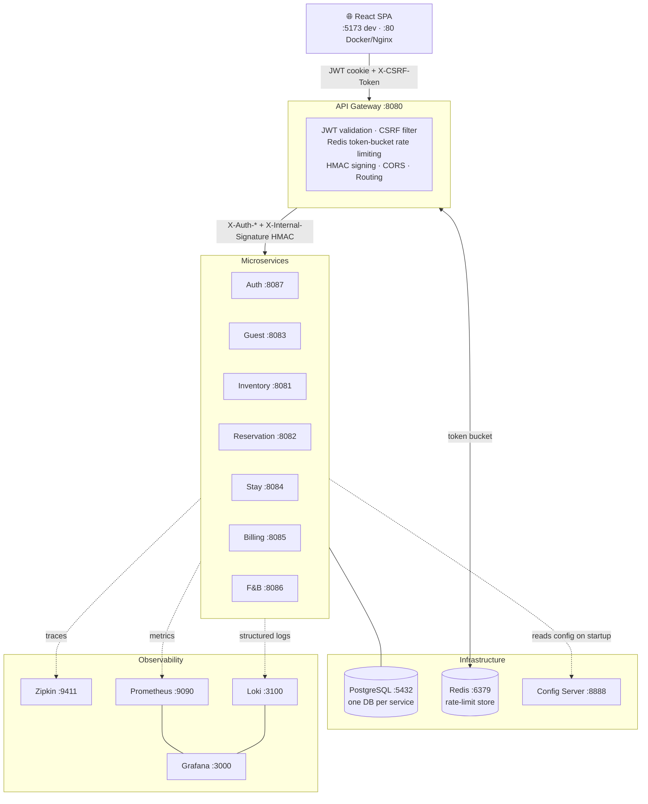

# 🏨 Enterprise Hotel PMS

[](https://github.com/diegoandruccioli/hotel-pms/actions/workflows/ci.yml)
[](https://openjdk.org/projects/jdk/21/)
[](https://spring.io/projects/spring-boot)
[](https://react.dev)
[](https://www.typescriptlang.org/)
[](docker-compose.yml)

An enterprise-grade, microservices-based **Hotel Property Management System**.  
This platform orchestrates hotel operations — from reservations and guest management to food & beverage point-of-sale, billing, and housekeeping — powered by a modern React frontend and a highly scalable Spring Boot backend ecosystem.

---

## Project Status & Scope

This is a **production-grade enterprise PMS** validated for real hotel operations with a single property. The system meets the minimum bar for enterprise classification across all five dimensions below.

### Enterprise minimum bar — met

| Dimension | Requirement | This system |
|-----------|-------------|-------------|
| **Multi-tenancy** | Data isolated per tenant at row level, enforced by infrastructure | `hotel_id` NOT NULL on every entity; injected from verified JWT, never from client input; all repositories filter by `hotel_id` |
| **Security posture** | Hardened auth, inter-service trust, least-privilege access | JWT in httpOnly cookies (XSS-proof), HMAC-SHA256 on every Feign call (zero-trust internal), CSRF, Redis token-bucket rate limiting, RBAC enforced at gateway + endpoint level, GDPR Art. 20 + right-to-erasure |
| **Operational compliance** | Regulatory integrations handled in production | Alloggiati Web v2.0 SOAP (art. 109 TULPS) — two-step protocol, 168-char fixed-width format, CRLF, error codes; collaudo plan documented |
| **Observability** | Distributed tracing, metrics, structured logging | Zipkin (trace propagation via `X-Correlation-ID`), Prometheus + Grafana, Loki, Spring Boot Actuator on all services |
| **Resilience** | Graceful degradation under partial failure | Resilience4j `@CircuitBreaker` on every Feign client; service outages do not cascade; RFC 7807 problem details from all services |

### Complete and production-ready

- 9 microservices, full RBAC (ADMIN / OWNER / RECEPTIONIST), JWT httpOnly + HMAC internal auth, CSRF, rate limiting
- Alloggiati Web v2.0 SOAP integration (art. 109 TULPS) — collaudo with real PS portal documented in [`docs/ALLOGGIATI_COLLAUDO_REALE.md`](docs/ALLOGGIATI_COLLAUDO_REALE.md)
- F&B → room charge billing, walk-in check-in, multi-tenant data isolation (`hotel_id` on every entity)
- GDPR Art. 20 data export, structured PII audit log, right-to-erasure anonymisation
- Security hardening fully documented in `docs/security-report/report-secure-coding.tex`
- CI pipeline (GitHub Actions): build, unit tests, Playwright E2E, Trivy image scan

### Stable

- **Coverage**: JaCoCo (≥40% instruction) and Vitest (stmt/branch/fn/lines) coverage thresholds are enforced in CI — build fails if coverage drops below configured minimums. (commit `dab4eea`)
- **CVE-2026-42577** (Netty epoll DoS): accepted residual risk — JDK NIO transport is active, Netty 4.2.x is not yet compatible with the fix; mitigated by network-layer isolation

### Roadmap

Le implementazioni future sono documentate in dettaglio in
[`docs/ROADMAP.md`](docs/ROADMAP.md).

**Prossime priorità (Sprint 1 — Production-ready, 4-6 settimane):**
- Backup PostgreSQL automatizzato (pg_dump cron)
- Prometheus alert rules (error rate, latency, container restarts)

_Già completati:_ `@Version` su `Invoice` ✓ · `restart: unless-stopped` su tutti i container ✓ · Operations Runbook ✓

**Gap commerciali principali (Sprint 2-3):**
- Channel Manager OTA — prerequisito per 80% del mercato hotel
- Email/SMS conferme prenotazione (standard minimo assoluto)
- Fattura fiscalmente valida (numerazione legale italiana, IVA disaggregata)
- Mobile PWA (70% infrastruttura già presente)
- Booking Engine + Stripe Checkout

Vedi [`docs/ROADMAP.md`](docs/ROADMAP.md) per la roadmap completa
con effort, dipendenze, confronto competitor e timeline Enterprise SaaS.

See [`docs/FINAL_AUDIT_ULTRA_SEVERE.md`](docs/FINAL_AUDIT_ULTRA_SEVERE.md) for the evidence-based audit with all open gaps, accepted risks, and the explicit roadmap.

---

## Tech Stack

| Layer | Technology |
|-------|-----------|
| **Language (Backend)** | Java 21 |
| **Language (Frontend)** | TypeScript 5.x |
| **Backend Framework** | Spring Boot 3.5.x, Spring Cloud 2025.0 |
| **Frontend Framework** | React 19, Vite 7.x |
| **State Management** | Zustand |
| **Styling** | Tailwind CSS 3.x |
| **Internationalization** | i18next + react-i18next (EN / IT) |
| **API Gateway** | Spring Cloud Gateway (WebFlux / Reactive) |
| **Auth** | JWT (HMAC-SHA256) – stateless, cookie-based |
| **Rate Limiting** | Spring Cloud Gateway + Redis Token Bucket |
| **Database** | PostgreSQL 15 (one DB per microservice) |
| **Migrations** | Flyway |
| **ORM / Mapping** | Spring Data JPA, MapStruct, Lombok |
| **Resilience** | Resilience4j (Circuit Breaker on Feign clients) |
| **Observability** | Zipkin (distributed tracing), Prometheus (metrics), Spring Boot Actuator |
| **Code Quality** | PMD via `gradle-java-qa` plugin (zero-warning policy) |
| **Testing (Backend)** | JUnit 5 + Mockito |\
| **Testing (Frontend)** | Vitest (unit), Playwright (E2E), vitest-axe (a11y) |
| **Build** | Gradle (Kotlin DSL), npm |
| **Containerization** | Docker, Docker Compose |

---

## Architecture Overview

The system follows a **distributed microservices** pattern with centralized configuration and an API Gateway as the single entry point.



### Ports Map

| Service | Port | Type |
|---------|------|------|
| React Frontend (dev) | `5173` | Frontend |
| Frontend (Docker/Nginx) | `80` | Frontend |
| API Gateway | `8080` | Edge Gateway |
| Config Server | `8888` | Infrastructure |
| Auth Service | `8087` | Microservice |
| Guest Service | `8083` | Microservice |
| Inventory Service | `8081` | Microservice |
| Reservation Service | `8082` | Microservice |
| Stay Service | `8084` | Microservice |
| Billing Service | `8085` | Microservice |
| F&B Service | `8086` | Microservice |
| PostgreSQL | `5432` | Database |
| Redis | `6379` | Cache |
| Zipkin | `9411` | Tracing |
| Prometheus | `9090` | Metrics |

> All client traffic should go through the **API Gateway** on port `8080`, which enforces JWT validation, CORS policies, and rate limiting.

---

## Performance & Rate Limits

Design targets for single-property deployment (≤ 20 concurrent hotel staff users):

| Endpoint group | Sustained rate | Burst capacity | Notes |
|---|---|---|---|
| `POST /api/v1/auth/login` | 5 req/s | 10 req | Per client IP — brute-force mitigation |
| `GET|POST /api/v1/auth/users/**` | 10 req/s | 20 req | Per authenticated user |
| All other `/api/v1/**` | 20 req/s | 50 req | Per authenticated user |

Rate limits are enforced by Spring Cloud Gateway's Redis token-bucket (`RequestRateLimiterGatewayFilterFactory`). Clients exceeding the limit receive `429 Too Many Requests` with `Retry-After: 1` and a RFC 9110 problem details body.

> **Note:** No formal load testing has been performed. The figures above are the configured gateway limits, not measured throughput ceilings.

---

## Key Technical Decisions & Trade-offs

Non-obvious choices made during development, with the reasoning behind each.

| Decision | Chosen approach | Why | Alternative not chosen |
|---|---|---|---|
| **Service topology** | One PostgreSQL DB per microservice | True data isolation; no cross-service SQL JOINs; independent schema evolution via Flyway | Shared DB: simpler but creates coupling, blocks independent deployments, risks GDPR data leakage across tenants |
| **Auth token storage** | JWT in httpOnly cookies | Eliminates XSS token theft — browser never exposes the token to JavaScript | `localStorage`: simpler but vulnerable to XSS; rejected as a non-negotiable security baseline |
| **Internal service auth** | HMAC-SHA256 on every Feign call (`X-Internal-Signature`) | Zero-trust between services: a compromised internal network cannot forge calls without the shared secret | Mutual TLS: stronger but requires certificate infrastructure not yet justified at this scale |
| **Guest full-text search** | PostgreSQL `pg_trgm` GIN index | ILIKE `%keyword%` goes from O(n) full-table scan to O(log n) index scan; no additional infrastructure | Elasticsearch / OpenSearch: more powerful but adds a full search cluster for a problem PostgreSQL solves natively at single-hotel volumes |
| **Invoice collection loading** | `@NamedEntityGraph` + `@EntityGraph` on repository | Eliminates N+1: `findByHotelId(pageable)` loads `charges` + `payments` in one LEFT JOIN instead of N separate queries per row | `@Transactional` + `Hibernate.initialize()`: works but couples service logic to persistence internals |
| **Concurrent billing writes** | `@Version` optimistic locking on `Invoice` | F&B and billing can both add charges; Hibernate raises `OptimisticLockException` on conflict instead of silently overwriting data | Pessimistic lock (`SELECT FOR UPDATE`): serialises all writes, degrades throughput unnecessarily for low-contention workloads |
| **Resilience** | Resilience4j `@CircuitBreaker` on all Feign clients | Graceful degradation: if `stay-service` is down, GDPR export returns partial data; check-in is never blocked by a `billing-service` outage | No circuit breaker: simpler code but a single service failure cascades to full system outage |
| **Multi-tenancy** | `hotel_id` column on every entity, injected from JWT via API Gateway | Row-level isolation with no application-layer complexity; `hotel_id` is extracted from the verified JWT, never from client input | Schema-per-tenant: stronger isolation but 9× schema management overhead per hotel added |
| **Why microservices at this scale** | 9 bounded contexts, independent deployability | Each domain (billing, stays, guests, inventory) has distinct data models and lifecycles; boundary design anticipates multi-hotel scaling and eventual Kubernetes deployment | Monolith: faster initial development but mixing billing/stay/GDPR domains creates long-term coupling that is harder to isolate for compliance audits |

---

## How to Run

### TL;DR — up and running in 1 command

```bash
# Linux / macOS
chmod +x start.sh && ./start.sh

# Windows PowerShell
.\start.ps1

# Windows CMD
start.bat
```

The script auto-generates `.env` with random secrets on first run — no manual setup needed.  
To customise Alloggiati PS credentials beforehand: `cp .env.example .env` and edit it first.

Open **http://localhost:5173** · Login: `admin` / `password` · Password change required on first login.

---

### Prerequisites

- **Java 21** (JDK)
- **Node.js 18+** & **npm**
- **Docker** & **Docker Compose**

### HMAC Secret Setup (first time only)

Before starting, generate the shared HMAC secret used for internal service-to-service authentication:

```bash
# Linux / macOS
chmod +x setup-hmac-secret.sh && ./setup-hmac-secret.sh

# Windows PowerShell
.\setup-hmac-secret.ps1
```

### One-Click Startup

Use the provided scripts to boot the entire ecosystem. Each script will:
1. Run a pre-flight port check
2. Ensure Docker Desktop is running
3. Generate HMAC / JWT secrets (first time only)
4. Build all microservices with `./gradlew clean build -x test`
5. Start all Docker containers (`docker compose up -d --build`)
6. Wait for the **Config Server** to become healthy
7. Wait for the **API Gateway** to become healthy
8. Install frontend dependencies (if needed) and start the Vite dev server

```bash
# Linux / macOS
chmod +x start.sh && ./start.sh

# Windows CMD
start.bat

# Windows PowerShell
.\start.ps1
```

Once all services are running, open **http://localhost:5173** in your browser.

### Environment Variables

Copy `.env.example` to `.env` before starting. Key variables:

| Variable | Description | Default |
|----------|-------------|---------|
| `INTERNAL_HMAC_SECRET` | Shared secret for internal service-to-service auth (auto-generated by setup script) | — |
| `JWT_SECRET` | JWT signing secret (auto-generated by setup script) | — |
| `POSTGRES_PASSWORD` | PostgreSQL superuser password (auto-generated by setup script) | — |
| `CONFIG_SERVER_PASSWORD` | Spring Cloud Config Server HTTP basic auth password (auto-generated) | — |
| `ALLOGGIATI_USERNAME` | Polizia di Stato portal username | `ci_placeholder_user` |
| `ALLOGGIATI_PASSWORD` | Polizia di Stato portal password | `ci_placeholder_password` |
| `ALLOGGIATI_WS_KEY` | PS web service key | `ci_placeholder_wskey` |
| `ALLOGGIATI_DRY_RUN` | `true` = skip real SOAP calls (safe for development) | `true` |

### Operational Limits

| Limit | Detail |
|-------|--------|
| **No automated deployment** | GitHub Actions CI runs tests and Trivy scans on push; no push-to-deploy pipeline. |
| **No backup strategy** | PostgreSQL data lives in Docker named volumes. No automated backup or point-in-time recovery. |
| **No Kubernetes yet** | Infrastructure is Docker Compose only. K8s manifests are planned post-exam. All containers are stateless and K8s-ready by design (`restart: unless-stopped` on all services). |
| **Single region / single node** | No geographic redundancy. Each service runs as a single container with a single PostgreSQL instance. |
| **No outbound notifications** | Reservation confirmations, check-in receipts, and billing summaries are not sent via email or SMS. |
| **Grafana CVE residue** | Grafana 11.5.0 Alpine layer carries unpatched OS-level CVEs (OpenSSL, musl, zlib). Dismissed as "won't fix" — internal monitoring tool, no guest PII, isolated Docker network. Documented in `report-secure-coding.tex` §DEP-CVE-04. |

---

## Default Admin Credentials

The system is seeded with a default administrator account on first boot:

| Field | Value |
|-------|-------|
| **Username** | `admin` |
| **Password** | `password` |
| **Email** | `admin@hotel.com` |
| **Role** | `ADMIN` |

> ⚠️ **Change the default password** in any non-development environment.

### First login

On first login the system forces a password change — no operations are available until a new password is set. The redirect to `/profile` is automatic and mandatory.

Password policy: ≥16 characters, 2 uppercase, 2 digits, 2 special characters.

After changing the password, complete the initial setup before starting operations:

1. **Hotel Profile** (`/profile/hotel`) — name, address, VAT number, fiscal code, logo
2. **Room types** (`/rooms`) — define types (Single, Double, Suite) with rates and capacity
3. **Rooms** — add physical rooms with number and type
4. **F&B menu** (`/restaurant`) — add menu items with prices (ADMIN/OWNER only)
5. **User accounts** (`/admin/users`) — create receptionist accounts with temporary passwords

---

## Project Structure

```
hotel-pms/
├── api-gateway/           # Spring Cloud Gateway (JWT validation, rate limiting, routing)
├── auth-service/          # Authentication & user management (JWT issuance)
├── billing-service/       # Invoices and payment tracking
├── config-service/        # Spring Cloud Config Server (native profile)
├── fb-service/            # Food & Beverage / Restaurant POS
├── guest-service/         # Guest profile management
├── inventory-service/     # Room types and room inventory
├── reservation-service/   # Booking management
├── stay-service/          # Check-in / check-out / Alloggiati reports
├── frontend/              # React SPA (Vite + TypeScript + Tailwind)
├── docker/                # Docker init scripts (PostgreSQL multi-DB setup)
├── docs/                  # Technical documentation (architecture, security, user manual, audit)
├── docker-compose.yml     # Full production-grade compose file
├── start.sh               # One-click startup (Linux/macOS)
├── start.bat              # One-click startup (Windows CMD)
├── start.ps1              # One-click startup (Windows PowerShell)
├── setup-hmac-secret.sh   # HMAC secret generator (Linux/macOS)
└── setup-hmac-secret.ps1  # HMAC secret generator (Windows PowerShell)
```

---

## Testing

### Backend (JUnit 5 + Mockito)
```bash
./gradlew clean build              # Runs all tests + PMD + Checkstyle
./gradlew test jacocoTestReport    # Tests + JaCoCo coverage reports (HTML + XML)
# Reports: {service}/build/reports/jacoco/test/html/index.html
```

### Frontend Unit Tests (Vitest)
```bash
cd frontend
npm run test                       # Run once
npm run test:coverage              # Run once + V8 coverage report
# Report: frontend/coverage/index.html
```

### Frontend E2E Tests (Playwright)
```bash
cd frontend
npm run test:e2e
```

### Coverage Baseline (measured 2026-05-11)

| Layer | Statements | Branches | Lines |
|-------|-----------|----------|-------|
| Frontend (Vitest V8) | 68.6% | 54.2% | 71.1% |
| Backend avg (JaCoCo) | ~60.1% instr. | ~50.4% | ~57.4% |

Thresholds enforced since 2026-05-16 (`dab4eea`). Build fails if coverage drops below configured minimums.

See [`docs/PILOT_READINESS_AUDIT.md §5b`](docs/PILOT_READINESS_AUDIT.md) for per-service breakdown and gap analysis.

---

## Branch Overview

| Branch | Role |
|--------|------|
| `main` | Final integrated state — build green, all tests pass |
| `pre-secure-coding` | Baseline snapshot before security hardening (exam reference) |
| `feature/secure-coding-hardening` | Full security hardening history — SHA cited in LaTeX report |
| `feature/frontend-development` | Development branch (source of all feature work) |

See [`docs/BRANCH_STRATEGY.md`](docs/BRANCH_STRATEGY.md) for full topology and governance rules.

---

## Documentation

| Document | Description |
|----------|-------------|
| [`docs/security-report/report-secure-coding.pdf`](docs/security-report/report-secure-coding.pdf) | **Secure Coding exam report (PDF)** — full security hardening documentation with threat model, mitigations, and commit references |
| [`docs/security-report/report-secure-coding.tex`](docs/security-report/report-secure-coding.tex) | LaTeX source for the exam report |
| [`THREAT_MODEL.md`](THREAT_MODEL.md) | Threat model — attack surfaces, mitigations table with commit references (security exam artifact) |
| [`docs/FINAL_AUDIT_ULTRA_SEVERE.md`](docs/FINAL_AUDIT_ULTRA_SEVERE.md) | **Production-readiness audit** — evidence-based, open gaps, accepted risks, roadmap |
| [`docs/PILOT_READINESS_AUDIT.md`](docs/PILOT_READINESS_AUDIT.md) | Pilot readiness assessment — all critical blockers resolved; real coverage baseline §5b |
| [`docs/SECURITY_AND_PRIVACY.md`](docs/SECURITY_AND_PRIVACY.md) | Security model: JWT, HMAC, RBAC, CSRF, GDPR, TULPS compliance |
| [`docs/INTERACTION_FLOWS.md`](docs/INTERACTION_FLOWS.md) | 12 end-to-end service call chains (check-in, billing, walk-in, GDPR export, …) |
| [`docs/USER_MANUAL.md`](docs/USER_MANUAL.md) | Step-by-step procedures for all user roles |
| [`docs/ALLOGGIATI_README.md`](docs/ALLOGGIATI_README.md) | Polizia di Stato SOAP integration — configuration and architecture |
| [`docs/DOCUMENTAZIONE_TECNICA_ALLOGGIATI_PS.md`](docs/DOCUMENTAZIONE_TECNICA_ALLOGGIATI_PS.md) | Deep-dive: WSDL bindings, field mapping, error codes, TULPS legal context |
| [`docs/ALLOGGIATI_COLLAUDO_REALE.md`](docs/ALLOGGIATI_COLLAUDO_REALE.md) | Real-portal test plan — 18 test cases, Go/No-Go criteria |
| [`docs/I18N.md`](docs/I18N.md) | i18n architecture, namespace conventions, anti-hardcoding rules |
| [`docs/GAP_ANALYSIS.md`](docs/GAP_ANALYSIS.md) | Gap analysis — 17 items tracked (all resolved as of 2026-05-07) |
| [`docs/BRANCH_STRATEGY.md`](docs/BRANCH_STRATEGY.md) | Branch topology, merge history, governance rules |
| [`backup/DECISIONS.md`](backup/DECISIONS.md) | All binding architectural and business decisions (internal reference — read at session start) |
| [`docs/ROADMAP.md`](docs/ROADMAP.md) | Enterprise roadmap — 4 sprints from Pilot-ready to Enterprise SaaS, competitor matrix, pricing model |
| [`SECURITY.md`](SECURITY.md) | Responsible disclosure policy, in-scope vulnerabilities, accepted risks, security contact |
| [`CONTRIBUTING.md`](CONTRIBUTING.md) | Developer onboarding, commit conventions, branch strategy, testing patterns |
| [`CHANGELOG.md`](CHANGELOG.md) | Release history — v0.1.0-pilot feature list, security hardening, infrastructure |
| [`docs/OPERATIONS_RUNBOOK.md`](docs/OPERATIONS_RUNBOOK.md) | Operational procedures — start/stop, backup, ADMIN recovery, log reading, credentials update |
| [`docs/DEPLOYMENT_GUIDE.md`](docs/DEPLOYMENT_GUIDE.md) | Production deployment — server requirements, HTTPS, nginx, firewall, update procedure |
| [`docs/API_REFERENCE.md`](docs/API_REFERENCE.md) | API reference — auth flow, main endpoints, error codes, rate limiting |

---

## API Stability

All endpoints under `/api/v1/` are stable within the current major version. Breaking changes (removed fields, changed semantics, authentication requirements) will increment the path prefix to `/api/v2/`. No `/api/v2/` endpoints exist in the current release.

| Guarantee | Scope |
|---|---|
| **Stable** | All `/api/v1/**` request/response shapes |
| **Internal** | `X-Auth-*`, `X-Internal-Signature` headers — consumed by services only, not by external clients |
| **No guarantee** | Actuator endpoints (`/actuator/**`) — management use only, exposed on port `:8090`, not through the public gateway |

---

## Security

Found a vulnerability? See [SECURITY.md](SECURITY.md) for the responsible disclosure policy.

**Do not** open a public GitHub issue for security findings — private disclosure first.

---

## License

This project is open source and available for evaluation, adaptation, and deployment.
